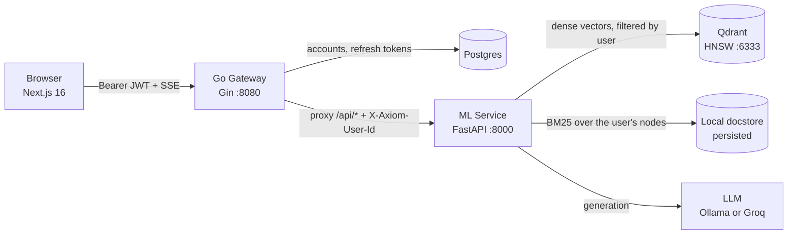

# Axiom AI

[](https://github.com/AYUSHSAINI9876/axiom-ai/actions/workflows/ci.yml)
[](LICENSE)
[](gateway/)
[](ml-service/)
[](frontend/)

A distributed, multi-tenant **Retrieval-Augmented Generation** system for technical and
scientific literature. Sign in, upload your own documents, and get streamed, cited
answers grounded in the source text — with every account's corpus isolated from every
other's.

Axiom AI runs **hybrid retrieval**: a dense vector search over Qdrant and a BM25
keyword search over the corpus, fused with reciprocal rank reranking. Dense search
alone misses exact identifiers (reaction names, symbols, equation labels); BM25 alone
misses paraphrase. Fusing them handles both.

---

## Architecture



The browser only ever talks to the gateway — a single origin, so CORS is configured in
exactly one place. The gateway is also the **only** authentication boundary: it
verifies the access token, then reverse-proxies `/api/*` to the ML service with the
caller's identity stamped on the request.

| Service | Stack | Port | Role |
| --- | --- | --- | --- |
| `frontend` | Next.js 16 (App Router), React 19, Tailwind 4 | 3000 | Auth screens, chat UI, conversation history, uploads |
| `gateway` | Go 1.26, Gin | 8080 | Auth, reverse proxy, CORS boundary, rate limiting |
| `ml-service` | Python 3.10, FastAPI, LlamaIndex | 8000 | Per-user indexing, hybrid retrieval, LLM orchestration |
| `postgres` | Postgres 17 | 5432 | Accounts and refresh tokens |
| `qdrant` | Qdrant v1.19 | 6333 | Vector store (HNSW) |

---

## Quick start

### Prerequisites

- Docker & Docker Compose
- An LLM backend — either:
  - **Ollama** (local, default): [install](https://ollama.ai/), then `ollama pull llama3`
  - **Groq** (hosted): set `GROQ_API_KEY` — takes precedence when present, and is the
    easier option on a low-memory machine since nothing is loaded locally

### Run

```bash
cp .env.example .env      # optional — defaults work as-is
docker compose up --build
```

On Windows you can instead run `./run.ps1`, which checks Docker and Ollama first and
generates a `JWT_SECRET` into `.env` so your session survives restarts.

Then open **http://localhost:3000** and create an account. There is no demo or guest
shortcut — email and password is the only way in.

> **First boot** builds the images and downloads a ~130 MB embedding model, so give it
> a few minutes. The sign-in page tells you plainly if the API isn't up yet, and clears
> that warning by itself once it is.

### If you have limited RAM

`llama3` needs roughly **4 GB of free memory** to load. If Ollama can't allocate it,
answers fail with a message saying so. Two ways around it:

```bash
# a smaller local model
ollama pull llama3.2:3b        # then set LLM_MODEL=llama3.2:3b in .env

# or skip Ollama entirely - free key at https://console.groq.com/keys
echo "GROQ_API_KEY=gsk_..." >> .env
```

### Better retrieval, if the machine has room

The default stack embeds with quantized ONNX BGE (small, fast, no torch) — the same
image the Render blueprint deploys. For the higher-quality 1024-dim model, at the cost
of a ~4 GB image and 1.3 GB of weights:

```bash
docker compose -f docker-compose.yml -f docker-compose.full.yml up --build
```

### Adding documents

Upload PDF/Markdown/text files from the sidebar. Uploads are indexed incrementally —
new files are embedded and inserted without re-embedding the existing corpus.

Files placed directly in `data/docs/` act as a **starter corpus**: each new account is
seeded with a copy on first use, so a fresh sign-up has something to query immediately.

---

## Authentication

Auth lives entirely in the gateway. The ML service has no user model — it is told who
is calling and trusts that, which is safe because the gateway is the only thing that
can reach it.

| Method | Route | Description |
| --- | --- | --- |
| `POST` | `/auth/register` | Create an account → session |
| `POST` | `/auth/login` | Email + password → session |
| `POST` | `/auth/refresh` | Exchange a refresh token for a new pair (rotating) |
| `POST` | `/auth/logout` | Revoke a refresh token |
| `GET` | `/auth/me` | The signed-in user |

**Design decisions, and why:**

- **There is no demo, guest, or admin shortcut.** Registration and login are the only
  routes that mint a session; a credential-free entry point would undo everything
  below it, so its absence is asserted by tests in both the gateway and the frontend.
- **Passwords are bcrypt-hashed**, and anything over 72 bytes is rejected rather than
  silently truncated — bcrypt ignores the remainder, which would quietly weaken a long
  passphrase to its first 72 bytes.
- **Access tokens are 15-minute HS256 JWTs**; refresh tokens are 256-bit random values
  stored only as SHA-256 digests. A database leak yields no usable sessions.
- **Refresh tokens rotate on every use, with reuse detection.** Replaying a consumed
  token revokes every session for that account — the signature of a stolen token being
  replayed after the real client already rotated it.
- **Login never distinguishes "no such account" from "wrong password"**, and runs a
  bcrypt comparison against a dummy hash on the unknown-email path so response latency
  doesn't leak which emails are registered either.
- **JWT parsing pins HS256.** Without `WithValidMethods`, a token declaring
  `"alg":"none"` — or an RS256 token whose "public key" is this HMAC secret — would be
  accepted. That is the classic JWT algorithm-confusion bypass.
- **Tokens live in `localStorage`, not cookies.** In every deployed configuration the
  frontend (Vercel) and gateway (Render) are on different sites, so a cookie would need
  `SameSite=None` — which browsers increasingly block outright. The tradeoff is that
  `localStorage` is script-readable, which is why access tokens are short-lived and
  refresh tokens are revocable and rotated.
- **`JWT_SECRET` has no default.** If unset, the gateway generates a random one per
  process and logs a warning. A committed fallback secret would be a *shared* secret in
  every deployment; a random one merely ends sessions on restart.
- **Credential endpoints are rate limited** to 20 attempts per 15 minutes per IP.

### Per-user isolation

Both halves of the hybrid retriever are filtered independently, in different places:

- The **dense** side pushes a `user_id` payload filter down into Qdrant.
- **BM25 has no filter support at all**, so its retriever is constructed over only the
  requesting user's nodes.

Filtering one but not the other would leak another account's text into answers through
the unfiltered half. `ml-service/tests/test_main.py` asserts this directly: a marker
phrase present in only one user's document must never surface in another's sources.

The gateway strips any client-supplied `X-Axiom-User-Id`, `X-Axiom-User-Email`, and
`X-Axiom-Gateway-Key` header before setting its own from the verified token — otherwise
sending the header yourself would be enough to read someone else's corpus.

---

## Configuration

All variables are optional; the defaults below are what `docker compose` uses.

### `gateway`

| Variable | Default | Purpose |
| --- | --- | --- |
| `DATABASE_URL` | *(unset)* | Postgres DSN. **Unset falls back to an in-memory store** — fine for a bare `go run`, but accounts vanish on restart. |
| `JWT_SECRET` | *(random per process)* | Signs access tokens. Set it in production. |
| `ML_SERVICE_URL` | `http://ml-service:8000` | Proxy target. A scheme-less `host:port` is accepted. |
| `GATEWAY_SHARED_SECRET` | *(unset)* | Sent to the ML service to prove a request came through the gateway. Required when the ML service is publicly routable. |
| `PORT` | `8080` | Listen port |
| `CORS_ALLOWED_ORIGINS` | `http://localhost:3000` | Comma-separated. `https://*.vercel.app` matches preview deployments. |
| `TRUSTED_PROXIES` | *(none)* | `*` to trust `X-Forwarded-For` behind a managed host's edge. |
| `ACCESS_TOKEN_TTL_MINUTES` | `15` | Access token lifetime |
| `REFRESH_TOKEN_TTL_DAYS` | `30` | Refresh token lifetime |

### `ml-service`

| Variable | Default | Purpose |
| --- | --- | --- |
| `QDRANT_URL` | `http://localhost:6333` | Qdrant endpoint |
| `QDRANT_API_KEY` | *(unset)* | Required by Qdrant Cloud |
| `EMBED_BACKEND` | `huggingface` | Compose and Render set `fastembed` (ONNX, no torch) |
| `EMBED_MODEL` | `BAAI/bge-large-en-v1.5` | `BAAI/bge-small-en-v1.5` under `fastembed` |
| `OLLAMA_BASE_URL` | `http://localhost:11434` | Used when `GROQ_API_KEY` is unset |
| `GROQ_API_KEY` | *(unset)* | If set, uses a Groq-hosted model instead of Ollama |
| `LLM_MODEL` | `llama3` / `openai/gpt-oss-120b` | Depends on the backend. Use `llama3.2:3b` on a small machine. Groq no longer serves Llama models. |
| `GATEWAY_SHARED_SECRET` | *(unset)* | When set, rejects any request without the matching key |
| `DATA_DIR` | `./data/docs` | Corpus root; each user gets a subdirectory |
| `PERSIST_DIR` | `./storage` | Docstore/index metadata (survives restarts) |
| `AXIOM_SKIP_MODEL_INIT` | *(unset)* | `1` skips model init — used by the test suite |

### `frontend`

| Variable | Default | Purpose |
| --- | --- | --- |
| `NEXT_PUBLIC_API_URL` | `http://localhost:8080` | Gateway base URL. **Build-time** — `NEXT_PUBLIC_*` is inlined into the client bundle. |

---

## API

Every `/api/*` route requires `Authorization: Bearer <access token>`.

| Method | Route | Description |
| --- | --- | --- |
| `GET` | `/health` | Gateway liveness — public, does not touch the ML service |
| `GET` | `/api/health` | ML status: LLM backend, embedding model, index state, your doc count |
| `GET` | `/api/documents` | List your indexed documents |
| `POST` | `/api/upload` | Upload and incrementally index a document (multipart) |
| `DELETE` | `/api/documents/{name}` | Remove a document from disk, Qdrant, and the docstore |
| `POST` | `/api/chat` | Non-streaming query → answer + source nodes |
| `POST` | `/api/chat/stream` | SSE stream of `token` / `sources` / `done` / `error` frames |

---

## Features

- **Accounts** — register, sign in, sign out, rotating refresh tokens, and sign-out
  everywhere on token reuse. No demo or guest bypass.
- **Per-user corpora** — documents, retrieval, and conversation history are scoped to
  the signed-in account.
- **Hybrid search** — `QueryFusionRetriever` reciprocally reranks a dense vector
  retriever against a `BM25Retriever`.
- **Streamed answers** — tokens flow from the LLM through FastAPI SSE, the Go proxy,
  and into the browser, with a working "Stop generating" control.
- **Citations** — every answer lists the source chunks (file + relevance score) it was
  grounded in, expandable inline.
- **Incremental indexing and deletion** — uploads are inserted without rebuilding;
  deletes remove nodes from Qdrant *and* the docstore so they stop being cited.
- **Light/dark/system theming** — applied before first paint, so there's no flash.
- **Accessible, responsive UI** — mobile drawer sidebar, keyboard-navigable, live region
  for streamed output, `prefers-reduced-motion` respected.
- **Graceful degradation** — if the ML service or Ollama is down, the UI shows a clear
  error instead of hanging.

---

## Engineering notes

A few decisions that aren't obvious from the file tree:

- **`store_nodes_override=True` is load-bearing.** Qdrant stores node text itself, so
  LlamaIndex skips writing nodes to the local docstore by default. But `BM25Retriever`
  reads its corpus from that docstore — without the flag, the BM25 half of the hybrid
  retriever silently searches an empty corpus.
- **`delete_nodes` needs `delete_from_docstore=True`.** It defaults to false, which
  clears the vectors but leaves the nodes in the docstore — so a "deleted" document
  keeps coming back as a citation through the BM25 half. Caught by a test, not by hand.
- **The Qdrant collection name encodes the embedding model.** Vector dimensionality is
  fixed per collection (1024 for bge-large, 384 for bge-small), so switching backends
  against a shared name would fail every upsert on a dimension mismatch.
- **The ML service sets no CORS headers.** Only the gateway does. If both did, the proxy
  would forward duplicate `Access-Control-Allow-Origin` headers and browsers would reject
  the response.
- **`FlushInterval = -1` on the reverse proxy.** Without it, Go buffers the SSE stream
  until the response completes and tokens arrive all at once.
- **No `WriteTimeout` on the gateway's HTTP server.** It's an absolute deadline on the
  whole response, which would truncate long token streams mid-answer. Slowloris is
  handled with `ReadHeaderTimeout` instead.
- **Refresh rotation is an atomic `UPDATE … WHERE revoked = FALSE … RETURNING`.** A
  separate `SELECT` then `UPDATE` would let two concurrent refreshes both succeed.
- **The frontend shares one in-flight refresh across callers.** Several parallel 401s
  would otherwise each send the same refresh token, and rotation means all but the first
  get rejected as reuse — logging the user out.
- **Gateway tests run against a real `httptest` server**, not `httptest.NewRecorder()` —
  `httputil.ReverseProxy` probes the writer for `http.CloseNotifier`, which a recorder
  doesn't implement and panics on.
- **`modernc.org/sqlite` was considered and rejected.** It is a million-line generated C
  translation that needs gigabytes of RAM to compile; Postgres plus a small in-memory
  implementation covers the same ground with no build cost.

---

## Deployment

The frontend goes to **Vercel**, the two backend services and their database to
**Render**. Blueprints for both are in the repo: [`vercel.json`](vercel.json) and
[`render.yaml`](render.yaml).

### 1. Qdrant Cloud (free)

Render has no managed vector store, so create a free cluster at
[cloud.qdrant.io](https://cloud.qdrant.io/) and keep its **URL** and **API key**.

### 2. Groq (free)

Ollama is local-only and cannot be reached from a managed host, so the deployed ML
service needs a hosted LLM. Get a key at [console.groq.com](https://console.groq.com/keys).

### 3. Render — backend

Dashboard → **New → Blueprint** → select this repo. `render.yaml` provisions Postgres,
the gateway, and the ML service, and wires `DATABASE_URL`, `JWT_SECRET`,
`ML_SERVICE_URL`, and `GATEWAY_SHARED_SECRET` between them automatically.

You'll be prompted for the three values that come from outside the repo:
`QDRANT_URL`, `QDRANT_API_KEY`, `GROQ_API_KEY`. Leave `CORS_ALLOWED_ORIGINS` blank for
now — you don't have the Vercel URL yet.

Note that the ML service deploys from `Dockerfile.lite`, which swaps
sentence-transformers/torch for fastembed's ONNX runtime. The default image needs well
over a gigabyte of resident memory for `bge-large`; the lite one fits a small plan.

### 4. Vercel — frontend

Import the repo, then set:

- **Root Directory**: `frontend`
- **Environment variable**: `NEXT_PUBLIC_API_URL` = your gateway URL
  (e.g. `https://axiom-gateway.onrender.com`)

`NEXT_PUBLIC_*` is inlined at build time, so this must be set *before* the first build
— changing it later requires a redeploy, not just a restart.

### 5. Close the loop

Back on Render, set the gateway's `CORS_ALLOWED_ORIGINS` to your Vercel domain plus the
preview wildcard:

```
https://your-app.vercel.app,https://*.vercel.app
```

Render redeploys the gateway automatically. Open the Vercel URL and sign in.

> **On Render's free tier**, services sleep after 15 minutes idle, so the first request
> after a pause takes ~30 seconds while the container wakes. The free Postgres plan also
> expires after 30 days.

---

## Testing

```bash
# gateway — go vet + 22 tests (auth, proxy, SSE, isolation, config)
cd gateway && go vet ./... && go test ./...

# ml-service — 20 tests (health, upload→retrieve, streaming, per-user isolation)
cd ml-service && pip install -r requirements-dev.txt && pytest

# frontend — lint + 34 tests + production build
cd frontend && npm ci && npm run lint && npm run test && npm run build
```

CI runs all three suites, both Docker image variants, a `render.yaml` check, and an
end-to-end auth smoke test against a real Postgres on every push and PR.

### Manual QA checklist

After `docker compose up --build`:

1. `http://localhost:3000` shows the sign-in screen, not the chat UI, and no demo or
   guest button anywhere on it.
2. Create an account — you land in the chat with a "connected" status indicator.
3. The sidebar already lists the starter document seeded for your account.
4. Upload a document; it appears in the list.
5. Ask a question answerable from that doc — the response streams token-by-token with
   citation chips naming the right file. Click one to expand the source text.
6. Ask a dependent follow-up to confirm conversation history reaches the model.
7. Click "Stop generating" mid-stream — generation halts cleanly.
8. Create a second conversation, switch between them, reload — both persist.
9. **Sign out, register a second account.** The sidebar is empty of the first account's
   conversations, and its uploaded document is not listed.
10. Ask the second account about content only in the first account's document — it must
    answer that it doesn't have the information, and cite nothing from that file.
11. Toggle the theme (top right) — light, dark, system. Reload; the choice sticks with
    no flash of the wrong theme.
12. Resize to mobile width — the sidebar collapses into a drawer.
13. Stop the gateway and send a message — a clear error appears instead of a hang.
14. Tab through the UI with the keyboard only — all controls are reachable and the
    focus ring is visible.

---

## Project structure

```
.
├── data/docs/              # Starter corpus, copied into each new account
├── frontend/               # Next.js 16 UI
│   └── src/{app,components,context,lib}
├── gateway/                # Go reverse proxy + auth
│   ├── auth.go             # handlers + requireAuth middleware
│   ├── token.go            # JWT issuing/verification
│   ├── store*.go           # Store interface, Postgres and in-memory impls
│   ├── ratelimit.go
│   └── main.go
├── ml-service/             # FastAPI + LlamaIndex
│   ├── main.py
│   ├── Dockerfile.lite     # ONNX/no-torch deployment image
│   └── tests/
├── .github/workflows/ci.yml
├── docker-compose.yml
├── render.yaml             # Render blueprint (gateway + ml-service + Postgres)
├── vercel.json             # Vercel config (frontend)
└── run.ps1                 # Windows convenience wrapper
```

---

## License

[MIT](LICENSE) © Ayush Saini
