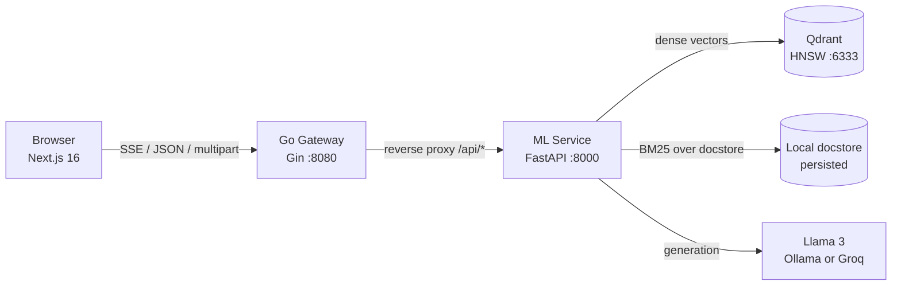

# Axiom AI

[](https://github.com/AYUSHSAINI9876/axiom-ai/actions/workflows/ci.yml)
[](LICENSE)
[](gateway/)
[](ml-service/)
[](frontend/)

A distributed **Retrieval-Augmented Generation** system for technical and scientific
literature. Ask questions against your own document corpus and get streamed, cited
answers grounded in the source text.

Axiom AI runs **hybrid retrieval**: a dense vector search over Qdrant and a BM25
keyword search over the full corpus, fused with reciprocal rank reranking. Dense search
alone misses exact identifiers (reaction names, symbols, equation labels); BM25 alone
misses paraphrase. Fusing them handles both.

---

## Architecture



The browser only ever talks to the gateway — a single origin, so CORS is configured in
exactly one place. The gateway reverse-proxies every `/api/*` route to the ML service,
transparently handling JSON, multipart uploads, and SSE token streams.

| Service | Stack | Port | Role |
| --- | --- | --- | --- |
| `frontend` | Next.js 16 (App Router), React 19, Tailwind 4 | 3000 | Chat UI, conversation history, uploads |
| `gateway` | Go 1.25, Gin | 8080 | Reverse proxy, CORS boundary, graceful shutdown |
| `ml-service` | Python 3.10, FastAPI, LlamaIndex | 8000 | Indexing, hybrid retrieval, LLM orchestration |
| `qdrant` | Qdrant v1.19 | 6333 | Vector store (HNSW) |

---

## Quick start

### Prerequisites

- Docker & Docker Compose
- An LLM backend — either:
  - **Ollama** (local, default): [install](https://ollama.ai/), then `ollama pull llama3`
  - **Groq** (hosted): set `GROQ_API_KEY` — takes precedence when present

### Run

```bash
cp .env.example .env      # optional — defaults work as-is
docker compose up --build
```

On Windows you can instead run `./run.ps1`, which checks for Ollama first.

Then open **http://localhost:3000**.

> **First boot takes several minutes.** The ML service downloads the
> `BAAI/bge-large-en-v1.5` embedding model (~1.3 GB). It's cached in the `hf_cache`
> volume, so later starts are fast. The gateway and UI come up immediately and show a
> clear status while the ML service warms up.

### Adding documents

Either drop PDF/Markdown/text files into `data/docs/`, or upload them from the sidebar
at runtime. Uploads are indexed incrementally — new files are embedded and inserted
without re-embedding the existing corpus.

---

## Configuration

All variables are optional; the defaults below are what `docker compose` uses.

### `ml-service`

| Variable | Default | Purpose |
| --- | --- | --- |
| `QDRANT_URL` | `http://localhost:6333` | Qdrant endpoint |
| `OLLAMA_BASE_URL` | `http://localhost:11434` | Ollama endpoint (used when `GROQ_API_KEY` is unset) |
| `GROQ_API_KEY` | *(unset)* | If set, uses Groq-hosted Llama 3 instead of Ollama |
| `DATA_DIR` | `./data/docs` | Corpus directory |
| `PERSIST_DIR` | `./storage` | Docstore/index metadata (survives restarts) |
| `AXIOM_SKIP_MODEL_INIT` | *(unset)* | `1` skips model init — used by the test suite |

### `gateway`

| Variable | Default | Purpose |
| --- | --- | --- |
| `ML_SERVICE_URL` | `http://ml-service:8000` | Proxy target |
| `PORT` | `8080` | Listen port |
| `CORS_ALLOWED_ORIGINS` | `http://localhost:3000` | Comma-separated allowed browser origins |

### `frontend`

| Variable | Default | Purpose |
| --- | --- | --- |
| `NEXT_PUBLIC_API_URL` | `http://localhost:8080` | Gateway base URL. **Build-time** — `NEXT_PUBLIC_*` is inlined into the client bundle, so Compose passes it as a build arg. |

---

## API

All routes are reachable through the gateway under `/api/*`.

| Method | Route | Description |
| --- | --- | --- |
| `GET` | `/health` | Gateway liveness (does not touch the ML service) |
| `GET` | `/api/health` | ML service status: LLM backend, embedding model, index state, doc count |
| `GET` | `/api/documents` | List indexed documents |
| `POST` | `/api/upload` | Upload and incrementally index a document (multipart) |
| `POST` | `/api/chat` | Non-streaming query → answer + source nodes |
| `POST` | `/api/chat/stream` | SSE stream of `token` / `sources` / `done` / `error` frames |

---

## Features

- **Hybrid search** — `QueryFusionRetriever` reciprocally reranks a dense vector
  retriever against a `BM25Retriever` built over the full corpus docstore.
- **Streamed answers** — tokens flow from the LLM through FastAPI SSE, the Go proxy, and
  into the browser, with a working "Stop generating" control.
- **Citations** — every answer lists the source chunks (file + relevance score) it was
  grounded in.
- **Incremental indexing** — uploads are embedded and inserted without rebuilding.
- **Persisted index** — the docstore survives restarts, so documents aren't silently
  re-embedded and duplicated in Qdrant.
- **Multi-conversation sidebar** — conversations persist in `localStorage` with
  auto-generated titles, switching, and delete.
- **Accessible, responsive UI** — mobile drawer sidebar, keyboard-navigable, live region
  for streamed output.
- **Graceful degradation** — if the ML service or Ollama is down, the UI shows a clear
  error instead of hanging.

---

## Engineering notes

A few decisions that aren't obvious from the file tree:

- **`store_nodes_override=True` is load-bearing.** Qdrant stores node text itself, so
  LlamaIndex skips writing nodes to the local docstore by default. But `BM25Retriever`
  reads its corpus from that docstore — without the flag, the BM25 half of the hybrid
  retriever silently searches an empty corpus.
- **The ML service sets no CORS headers.** Only the gateway does. If both did, the proxy
  would forward duplicate `Access-Control-Allow-Origin` headers and browsers would reject
  the response.
- **`FlushInterval = -1` on the reverse proxy.** Without it, Go buffers the SSE stream
  until the response completes and tokens arrive all at once.
- **No `WriteTimeout` on the gateway's HTTP server.** It's an absolute deadline on the
  whole response, which would truncate long token streams mid-answer. Slowloris is
  handled with `ReadHeaderTimeout` instead.
- **Gateway tests run against a real `httptest` server**, not `httptest.NewRecorder()` —
  `httputil.ReverseProxy` probes the writer for `http.CloseNotifier`, which a recorder
  doesn't implement and panics on.

---

## Testing

```bash
# gateway — go vet + 7 tests / 13 cases (proxy, SSE, 502 fallback, config)
cd gateway && go vet ./... && go test ./...

# ml-service — 5 tests (health, upload→retrieve, streaming, guards)
cd ml-service && pip install -r requirements-dev.txt && pytest

# frontend — lint + 19 tests + production build
cd frontend && npm ci && npm run lint && npm run test && npm run build
```

CI runs all three suites plus Docker image builds and a Compose config check on every
push and PR.

### Manual QA checklist

After `docker compose up --build`:

1. `http://localhost:3000` loads with a "connected" status indicator.
2. Upload a document from the sidebar; it appears in the document list.
3. Ask a question answerable from that doc — the response streams token-by-token with
   citation chips naming the right file.
4. Ask a dependent follow-up to confirm conversation history reaches the model.
5. Click "Stop generating" mid-stream — generation halts cleanly.
6. Create a second conversation, switch between them, reload — both persist.
7. Resize to mobile width — the sidebar collapses into a drawer.
8. Stop the gateway and send a message — a clear error appears instead of a hang.
9. Tab through the UI with the keyboard only — all controls are reachable.

---

## Project structure

```
.
├── data/docs/              # Document corpus (sample included)
├── frontend/               # Next.js 16 chat UI
│   └── src/{app,components,lib}
├── gateway/                # Go reverse proxy
│   ├── main.go
│   └── main_test.go
├── ml-service/             # FastAPI + LlamaIndex
│   ├── main.py
│   └── tests/
├── .github/workflows/ci.yml
├── docker-compose.yml
└── run.ps1                 # Windows convenience wrapper
```

---

## License

[MIT](LICENSE) © Ayush Saini
